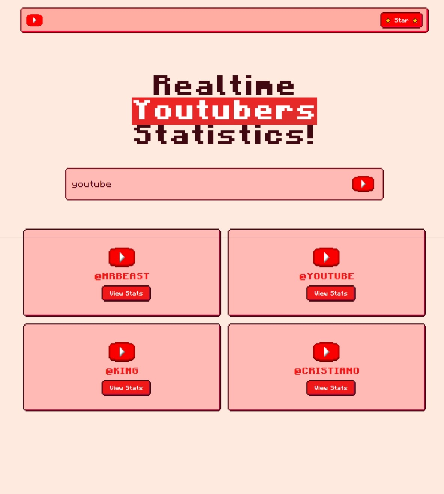
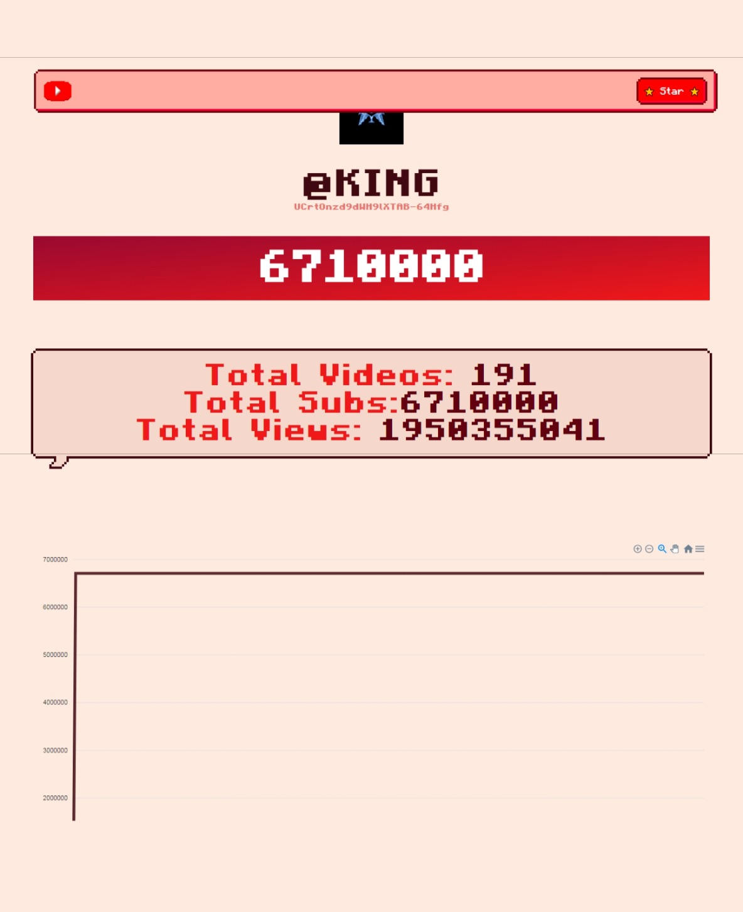
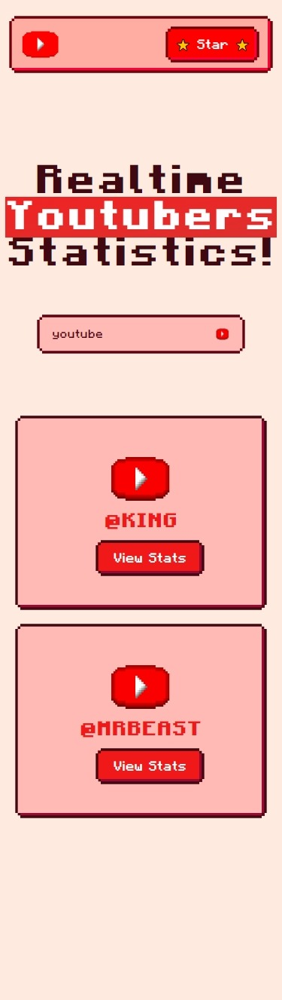
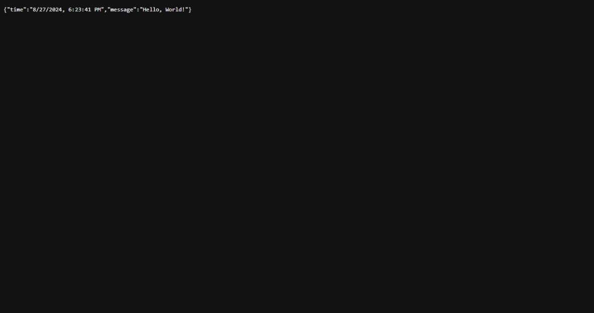

<h1 align="center">📊 YouTube Live Stats 📊</h1>

<p align="center">
    
</p>

> [!NOTE]
>
> Welcome to **YouTube Live Stats**! This project is designed to provide real-time statistics for YouTube channels, including total video views, subscribers, and live graphs of these metrics. With an easy-to-use interface, users can simply enter a YouTube channel handle to view live statistics and track their performance over time.

---

## 🥪 Tech Stack

- **Frontend:** Next.js, Retro UI, Tailwind CSS, ApexCharts
- **Backend:** Bun, Websockets
- **Data Pipeline:** Stateful Dataflows (SDF) powered by Fluvio

---

## 🙋‍♀️ How It Works

> [!IMPORTANT]
> Our data pipeline processes YouTube channel data by integrating with the YouTube Data API. It filters and validates channel handles, fetches essential statistics such as views, subscriber counts, and video counts, and updates the real-time statistics on the frontend. The integration with Fluvio's Stateful Dataflows ensures that data is efficiently processed and streamed for up-to-date insights.

## 🚀 Getting Started

To get started with the YouTube Live Stats project, follow these steps:

1. **Start Fluvio Cluster:**

   ```bash
   fluvio cluster start
   ```

2. **Run the Data Pipeline, include your youtube api key:**

   ```bash
   cd youtube-live
   sdf run --ephemeral -e YOUTUBE_API_KEY=...
   ```

3. **Start the Backend Application:**

   ```bash
   cd backend-app
   bun run start
   ```

4. **Start the Frontend Application:**
   ```bash
   cd frontend-app
   bun run dev
   ```

---

## 📷 Demo

| Home Page                                 |
| ----------------------------------------- |
|  |

| Live Youtube Channel Statistics With Graph |
| ------------------------------------------ |
|     |

| Mobile Response                               |
| --------------------------------------------- |
|  |

| Powered by Bun & Websockets       |
| --------------------------------- |
|  |

---

## 🤝 Contributing

We welcome contributions to improve **YouTube Live Stats**! To get started:

1. **Fork the Repository:** Click the "Fork" button at the top right of the page.
2. **Clone Your Fork:**
   ```bash
   git clone https://github.com/ArnavK-09/youtube_live_stats.git
   ```
3. **Create a Branch:**
   ```bash
   git checkout -b your-feature-branch
   ```
4. **Make Your Changes:** Implement your improvements or bug fixes.
5. **Commit Your Changes:**
   ```bash
   git add .
   git commit -m "Add your message here"
   ```
6. **Push to Your Fork:**
   ```bash
   git push origin your-feature-branch
   ```
7. **Create a Pull Request:** Go to the original repository and click "New Pull Request."

Please make sure your changes adhere to the project's coding standards and include tests if applicable.

## 📝 License

This project is licensed under the `Boost Software License - Version 1.0 ` License. See the [LICENSE](LICENSE) file for more details.

---

<p align="center">
    <strong>If you find this project helpful, please give it a ⭐ on GitHub!</strong>
</p>

<p align="center">
    
</p>
